# 2019

[[toc]]

## First Tweet Contact

### 2019-05-19

On May 19th, 2019, Hoshimachi Suisei announced that she would graduate from inide and join Hololive's new project "INNK Music".

The ever first Tweet contact was Toko congratulating Suisei for entering INNK, and hope her songs can reach out to the whole world.

> [Original Tweet](https://twitter.com/suisei_hosimati/status/1130054368886050816)

::: details Tweet Translation

 
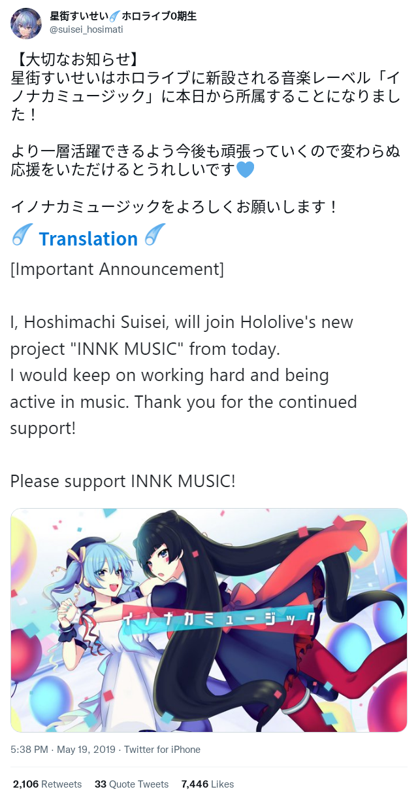
  
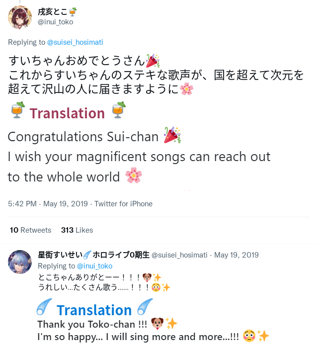

:::

## Casual Tweet

### 2019-05-21

Toko reached 60k subscribers and Suisei congratuated her on this.

They "kissed" a lot.

> [Original Tweet](https://twitter.com/suisei_hosimati/status/1130814178250317825)

::: details Tweet Translation

 
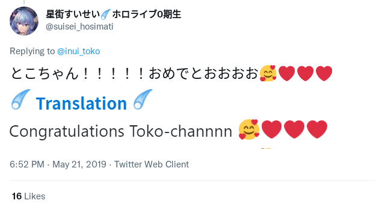
 
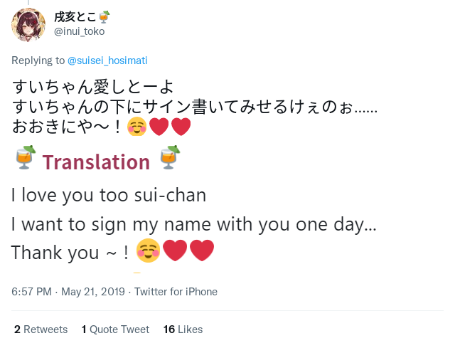
 

Note:

- The "signing" context is blurry but could be related to Ensemble Stars events.
- "3 of us" probably referes to [Hiro Minamori (graduated)](https://www.youtube.com/channel/UCuGMkxJA_icuiF01u8f3Y2Q)

:::

### 2019-06-07

Hoshimachi Suisei got the 8th place on Daily trending (2019-06-07), tweeted by Tsuranimizu (Her manager in INNK MUSIC).

Toko replied and they again "kissed" a lot.

> [Original Tweet](https://twitter.com/suisei_hosimati/status/1136678053243834370)

::: details Tweet Translation

 
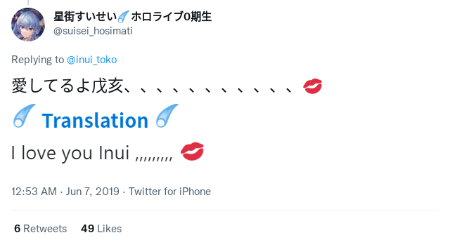
 
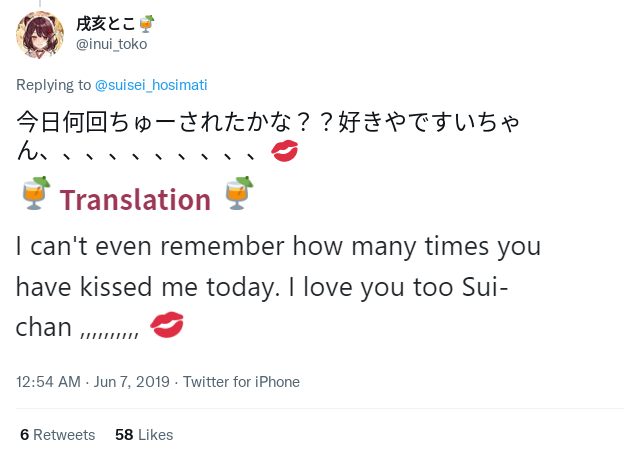
 
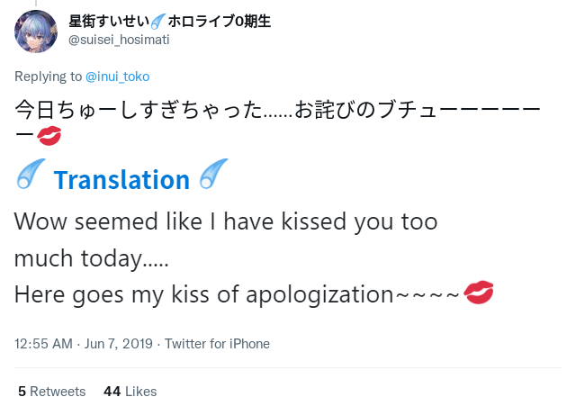

:::

### 2019-06-08

Suise reached 11,111 YouTube Channel sub, Toko congratulated her.

They also mentioned they want to sing together on live stage one day.

They did it on Dec 10th, 2020.

> [Original Tweet](https://twitter.com/suisei_hosimati/status/1137100337465085952)

::: details Tweet Translation

 
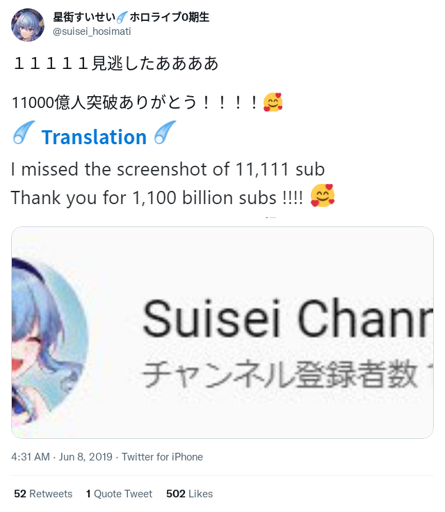
 

 
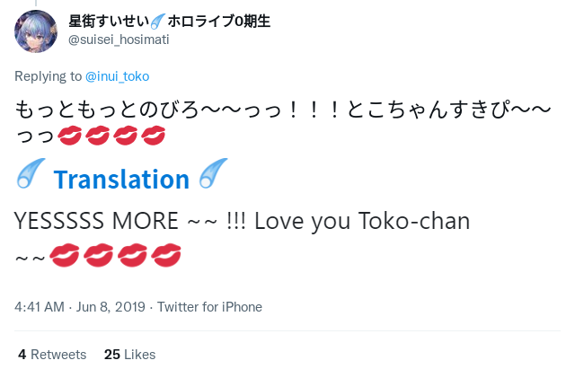
 
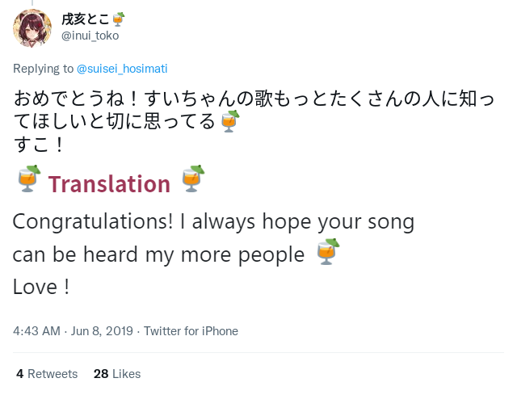
 
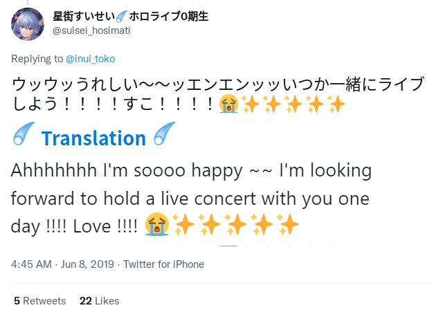
 
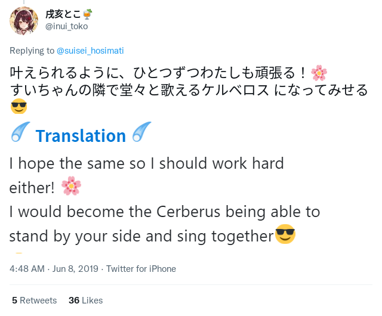
 
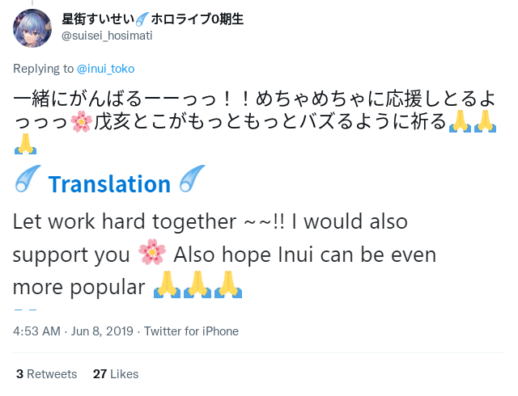

:::

## The birth of TOKOMACHI

### 2019-06-26

The first time appearing the unit name Tokomachi (とこまち) is on the Minecraft collab.

This is also the ever first collab of Tokomachi.

    

> [Original YouTube Stream](https://www.youtube.com/watch?v=Kr1jxq0ms00)

The naming logic is:

    Inui Toko + Hoshimachi Suisei = Tokomachi

::: tip Funny Episodes
1
2
3
:::