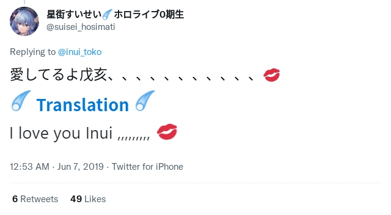
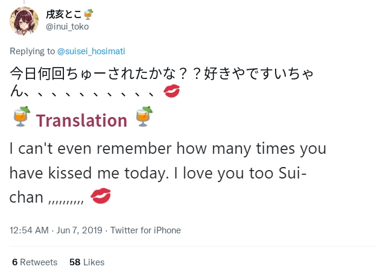
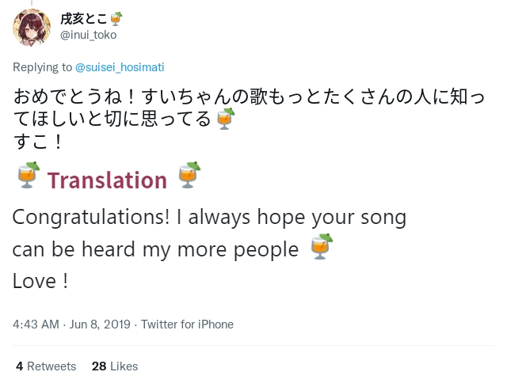
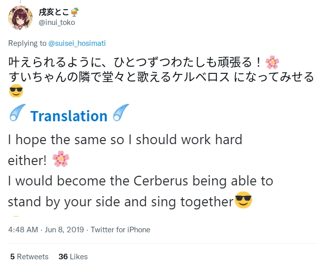
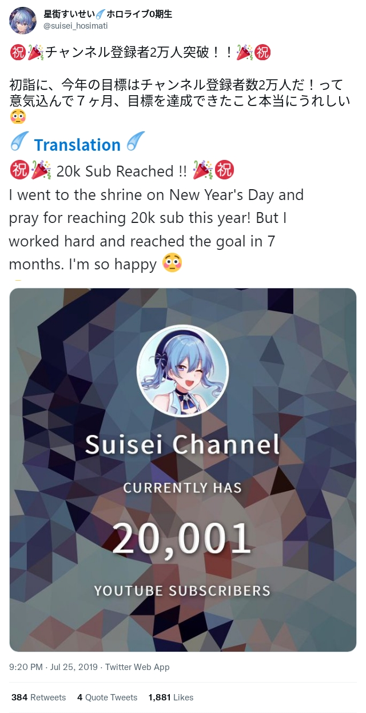
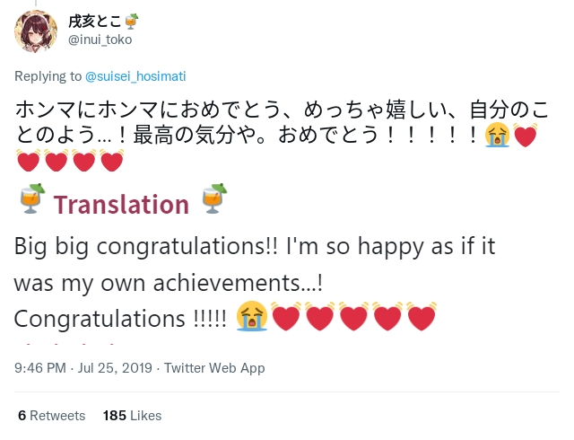

# 2019

[[toc]]

## First Tweet Contact

### 2019-05-19

On May 19th, 2019, Hoshimachi Suisei announced that she would graduate from inide and join Hololive's new project "INNK Music".

The ever first Tweet contact was Toko congratulating Suisei for entering INNK, and hope her songs can reach out to the whole world.

> [<i class="fa-brands fa-twitter" /> Original Tweet](https://twitter.com/suisei_hosimati/status/1130054368886050816)

::: details Tweet Translation

 

  

:::

## Casual Tweet

### 2019-05-21

Toko reached 60k subscribers and Suisei congratuated her on this.

They "kissed" a lot.

> [<i class="fa-brands fa-twitter" /> Original Tweet](https://twitter.com/suisei_hosimati/status/1130814178250317825)

::: details Tweet Translation

 

 

 

Note:

- The "signing" context is blurry but could be related to Ensemble Stars events.
- "3 of us" probably referes to [<i class="fab fa-youtube" /> Hiro Minamori (graduated)](https://www.youtube.com/channel/UCuGMkxJA_icuiF01u8f3Y2Q)

:::

### 2019-06-07

Hoshimachi Suisei got the 8th place on Daily trending (2019-06-07), tweeted by Tsuranimizu (Her manager in INNK MUSIC).

Toko replied and they again "kissed" a lot.

> [<i class="fa-brands fa-twitter" /> Original Tweet](https://twitter.com/suisei_hosimati/status/1136678053243834370)

::: details Tweet Translation

 

 

 

:::

### 2019-06-08

Suise reached 11,111 YouTube Channel sub, Toko congratulated her.

They also mentioned they want to sing together on live stage one day.

They did it on Dec 10th, 2020.

> [<i class="fa-brands fa-twitter" /> Original Tweet](https://twitter.com/suisei_hosimati/status/1137100337465085952)

::: details Tweet Translation

 

 

 

 

 

 

 

:::

## The birth of TOKOMACHI

### 2019-06-26

The first time appearing the unit name Tokomachi (とこまち) is on the Minecraft collab.

This is also the ever first collab of Tokomachi.

    

> [<i class="fab fa-youtube" /> Original YouTube Stream](https://www.youtube.com/watch?v=Kr1jxq0ms00)

The naming logic is:

    Inui Toko + Hoshimachi Suisei = Tokomachi

::: tip Funny Episodes
[13:38](https://www.youtube.com/watch?v=Kr1jxq0ms00&t=818s) Suisei and Toko were amused when seeing a wolf (dog) trying to get its fur dry

[14:23](https://www.youtube.com/watch?v=Kr1jxq0ms00&t=863s) Suisei asked Toko to do the same and Toko followed. Toko actually doesn't like being called a *dog* but she still followed.

[50:25](https://www.youtube.com/watch?v=Kr1jxq0ms00&t=3025s) Tokomachi Opera
:::

## 20k Sub Tweet

### 2019-07-25

Suisei reached 20k sub and it was her goal for 2019.

Toko congratulated and mentioned they want to dance in full 3D one day.

::: details Tweet Translation

 

 

 

:::

<link rel="stylesheet" href="https://cdn.jsdelivr.net/npm/@fortawesome/fontawesome-free@6.0.0/css/all.min.css" crossorigin="anonymous">