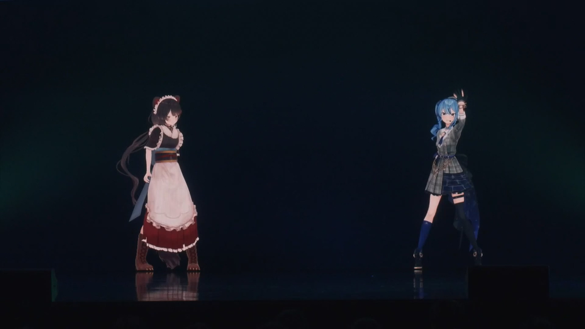

---
# NavLink
prev:
  text: "Previous: Tokomachi in 2019"
  link: /timeline/2019

next:
  text: "Next: Tokomachi in 2021"
  link: /timeline/2021
---

# Tokomachi in 2020

## Ensemble Stars !!

### Announcement of Ensemble Stars !!

## 3D Model Announcement

### 2020-03-01

::: tip Twitter Conversation

:::

## Ensemble Starts !! Delay and Start

### The delay and the Karaoke

### First Tokomachi Cover

The actual first ever Tokomachi cover song was  

## Gacha Stream

### 2020-04-03

*Dat scene*

Suisei successfully maxed out her credit card on stream.

Toko was supposed to be her guardian and look after her on stream.

## Radio Guest

 

[<i class="fa-solid fa-music"></i> Hoshimachi Suisei's Music Space ](https://www.youtube.com/playlist?list=PLAo9RlHR2tDb_gfVgqd0wKknI7oE8etmV) (Discontinued)

This is Hoshimachi Suisei's first ever radio program. The program focuses on music and Suisei invited a lot of Vtubers, singers and music-related talents to the program.

The program started from April 4th, 2020 and discontinued on March 28th, 2021 due to the program reform of Bunka Housou.

::: warning Note

\#08 and \#09 were recorded remotely due to COVID-19.

:::

### 2020-05-23

> [<i class="fab fa-youtube" /> Original YouTube Stream ](https://www.youtube.com/watch?v=8b7WYQ2vvSA&t=4873s)

Suisei was on a [<i class="fa-brands fa-twitter" /> one-week-long rest ](https://twitter.com/suisei_hosimati/status/1262763428931702790) but she suddenly appeared in Inui Toko's stream unexpectedly.

Since it was not a formal collab she had her mic off and typed in Minecraft chat.

Toko was also surprised to see her since it should be her vacation.

Suisei promoted for her radio program tomorrow since Toko would be the guest.

::: details The conversation and reactions

:comet: : Here I come! (started to *fish* Toko with her fishing rod)

:comet: : Everybody, please listen to my radio program!

:tropical_drink: : Well she is that kind of idol who won't forgot to promote for her own program even she's on her vacation.

:tropical_drink: : Are you having a good time Hoshimachi?

:comet: (Still trying to fish Toko happily)

:tropical_drink: : Alright seemed like she's having a good time, might also laughing now.

:::

Suisei also found out it had been a long while since last time she played Minecraft and already forgotten how to play.

But she still acted in a funny way and wrote diary.

Suisei also showed Toko her capability of *Lightspeed Idol Outfit Change*.

### 2020-05-24 \#08

> [<i class="fab fa-youtube" /> MUSIC SPACE #08 (First half) ](https://www.youtube.com/watch?v=WseyAVH4IlM)
> 
> [<i class="fab fa-youtube" /> MUSIC SPACE #08 (Second half) ](https://www.youtube.com/watch?v=6NZJpD45MOU)

This is the first time Suisei invited non-Hololive talent to her radio program.

They mentioned the place to want to go together is *Tokyo Disney Land*. 

And the Toko wants to go for Gourmet Tour in *Tokyo Disney Land*.

::: details About Toko's ears

(Talking about where a Mickey Mouse ear)

:comet: : Then there would be two kinds of ears, so what happened to your dog-like ears...

:tropical_drink: : Not dog, Cerberus.

:comet: : Well then what should we call the ear of Cerberus (nani mimi)?

:tropical_drink: : Cerberus ears (keru mimi).

:comet: : First time hearing (hatsu mimi)!

Note:
- *Don't* even try to call Toko a dog, she *doesn't* like it.
- Cerberus ears = Keruberus Mimi

:::

### 2020-05-31 \#09

> [<i class="fab fa-youtube" /> MUSIC SPACE #09 (First half) ](https://www.youtube.com/watch?v=-0ZKq0CvsPU)
> 
> [<i class="fab fa-youtube" /> MUSIC SPACE #09 (Second half) ](https://www.youtube.com/watch?v=bmNZg5LzkLI)

#### Live performance

Toko mentioned that they want to not just *sing together*, but also *dance together*.

Suisei said her favorite part of Toko is she laugh happily a lot. Toko said Suisei also laugh a lot. Their conversations were able to keep alive for a long time and they gained a lot of common language because of this.

Suisei really like Toko's performance on Virtual to Live 2019, Toko also invited Suisei to watch the *Blu-ray* replay together at home.

#### Anemachi

Toko thought Anemachi (Suisei's elder sister) was pretty funny. Not only during the lastest collab gacha stream, Anemachi often shows up when Suisei making a long call with Toko at night. Anemachi even invited Toko to go the *Tokyo Disney Land* together.

Suisei said because of Anemachi, she also became an Otaku. Toko said well seemed like it's because of Anemachi then we can meet each other.

Toko also got an elder sister, she also got influenced by her elder sister and started to read Manga and watch animes. Same as Suisei.

#### What for meal?

Suisei and Toko often go for a meal (mainly barbecue) in 2019, before COVID-19 breakout.

Suisei always decided pretty fast since she is only interest in meat / beef.

For the next meal, they quickly decided that should be [<i class="fa-brands fa-wikipedia-w"></i> Shabushabu ](https://en.wikipedia.org/wiki/Shabu-shabu)

#### Feeling nervous on stage?

Fan letter asked whether there were monsters on the stage (whether they would feel nervous on live concert stage), Toko and Suisei said they are more excited than nervous when seeing the audiences and the glow sticks in their hands.

Even there are, seemed like Toko would *politely eat them up* since she is the *mighty mighty Cerberus*.

## Totsumachi

### 2020-09-09

 

## Live guest

 

> [<i class="fab fa-youtube" /> Original YouTube Stream ](https://youtu.be/Q1t_vUj-fJQ&t=2068s)

## Tokomachi Radio

 

## Inui Toko 1st solo live "who i am"

 

### 2020-12-10

## New year

<!-- Fontawsome Script -->

<link rel="stylesheet" href="https://cdn.jsdelivr.net/npm/@fortawesome/fontawesome-free@6.0.0/css/all.min.css" crossorigin="anonymous">