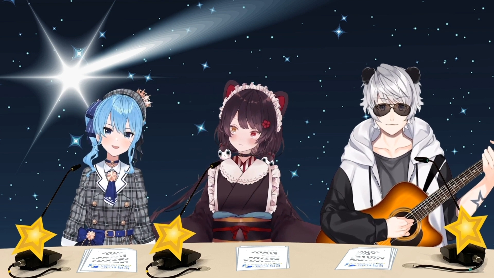
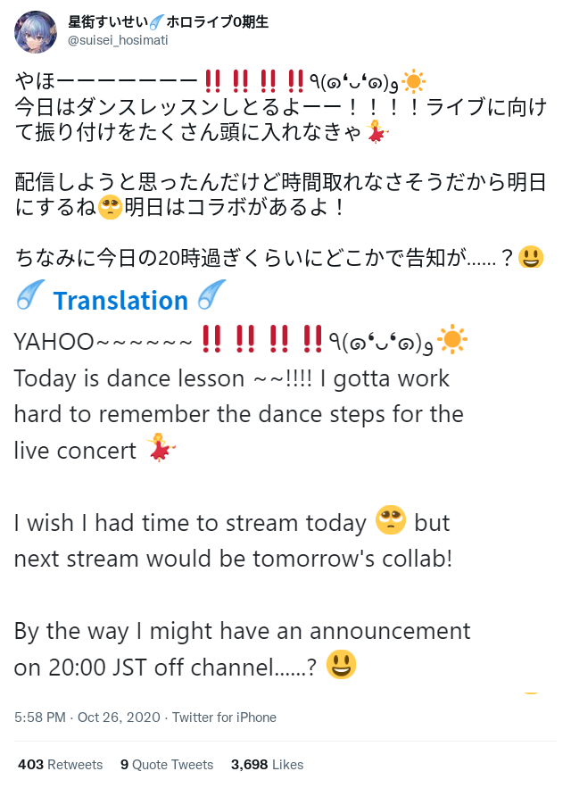
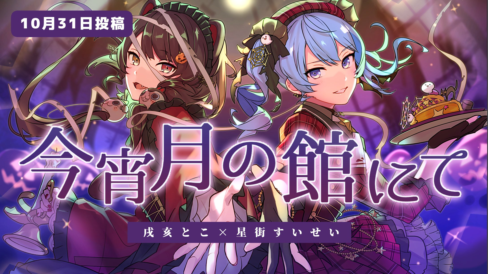
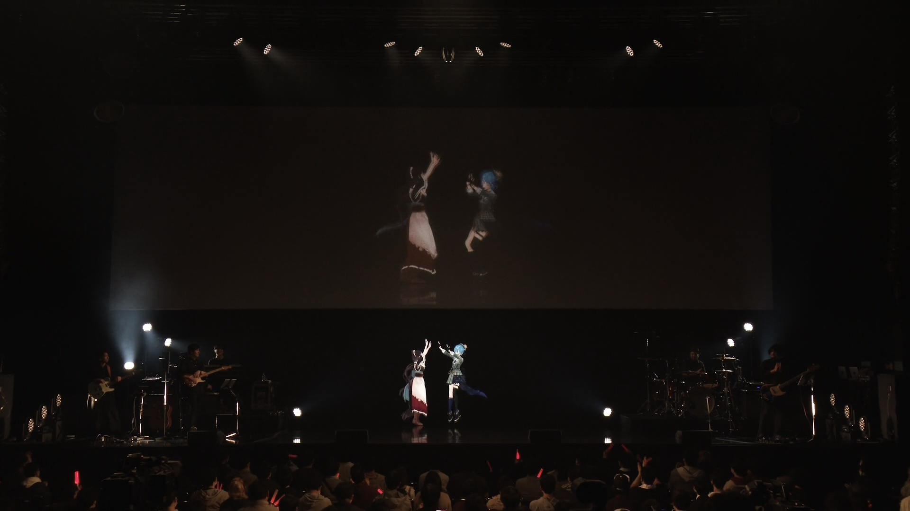
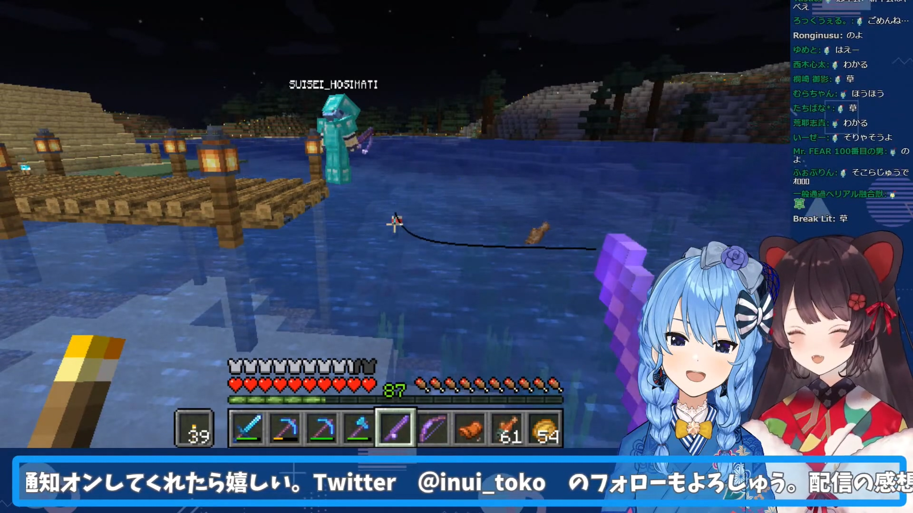

---
# NavLink
prev:
  text: 'Previous: Tokomachi in 2019'
  link: /timeline/2019

next:
  text: 'Next: Tokomachi in 2021'
  link: /timeline/2021
---

# Tokomachi in 2020 (WIP)

## Night fishing

### 2020-01-27

> [<i class="fab fa-youtube" /> Original YouTube Stream](https://youtu.be/bwAXmu5uYes)

After hearing the announcement of Ensemble Stars !! they were way too excited to sleep soundly. So they started to do a guerilla Minecraft night fishing stream and talking with each other.

Since it was right after, except talking about EnSta, they also mentioned they were pretty moved by each other's songs.

> [<i class="fab fa-youtube" /> Timestamp: Fishing Rod](https://youtu.be/bwAXmu5uYes?t=1385)

Suisei also renamed their fishing rods and put their names on each other's rod. But she mistakenly gave her rod to Toko. Toko joked that she won't give it back cutely. Suisei suddenly "threatened" to sing _Infinity Stars_, an Ensemble Stars !! song and Toko was frighted, giving back Suisei's rod immediately.

As mentioned above, EnSta / Happy Elements were very famous for having a strict copyright guideline, which means if Suisei did singed that song, Toko's YouTube channel would be demonetized and that's what YouTuber / Vtuber feared most.

This was called _the special way of singers to threaten_.

## 3D Model Announcement

### 2020-03-01

Suisei's 3D model announcement was scheduled on March 1st, 2020 and Toko's was a day later.

They were pretty happy about this.

::: details Twitter Conversation

:::

Suisei chose to make her 3D reveal event into a 3D live, which was the first time in Hololive. She also revealed  This was also the reason she caught even more attractions from all over the world.

On the other hand, their 3D models both appeared on the agencies' major fes first, then got revealed on their YouTube channel.

## Karaoke for 8 hours

### 2020-01-12

Unfortunately the release of Ensemble Stars !! was delayed because of various problems and difficulties. Both Suisei and Toko felt pretty down because of this. So they decided to solve it in singers' way - they cancelled their stream and went to Karaoke together.

According to Suisei's interview on [<i class="fa-solid fa-book"></i> _Hikari TV Guide (Page 49, Vol. 163, October 2020)_](https://www.hikaritv.net/guide/pdf/202110.pdf), the Karaoke tour lasted for _8 hours_.

::: details Twitter Conversation

:::

#### The delay and the Karaoke

### 2020-01-13

#### First Tokomachi Cover

The actual first ever Tokomachi cover song was this one. Because of EnSta / Happy Elements' well-known strict copyright guideline, they had to do it in Acapella and uploaded to Twitter only.

## Gacha Stream

### 2020-04-03

_Dat scene_

The original goal was to 

Suisei was pretty famous for having a bad luck, on the other hand, Toko was way more fortunate in Gacha games.

As a result Toko was supposed to be her guardian, provide her some "luck" and watched over her on stream, Suisei still successfully maxed out her credit card on stream.

The stream was done before Ensemble Stars !! got a guarantee system that let you get the _Picked Up_ character after doing a certain among of gachas. So she spent way more than expected (approximately 190,000 JPY).

This was also the first non-Minecraft game collab stream.

## MUSIC SPACE

[<i class="fa-solid fa-music" /> Hoshimachi Suisei's Music Space](https://www.youtube.com/playlist?list=PLAo9RlHR2tDb_gfVgqd0wKknI7oE8etmV) (Discontinued)

This is Hoshimachi Suisei's first ever radio program. The program focuses on music, and singing cover songs was one of its major segments. During it's run, Suisei invited a lot of Vtubers, singers and music-related talents to the program.

The program started on April 4th, 2020 and was discontinued on March 28th, 2021 due to the program reform of Bunka Housou.

::: warning Note

\#08 and \#09 were recorded remotely due to COVID-19.

:::

### 2020-05-23

> [<i class="fab fa-youtube" /> Timestamp: Suisei appeared](https://youtu.be/8b7WYQ2vvSA&t=4873s)

Suisei was on a [<i class="fa-brands fa-twitter" /> one week-long break](https://twitter.com/suisei_hosimati/status/1262763428931702790) but she appeared in Inui Toko's Minecraft Server while she was on stream unexpectedly. It was an informal collab, so Suisei had her mic off and only communicated via Minecraft chat.

Toko was also surprised to see her since Suisei should have been on break. During this time, Suisei fished and was fished in return by Toko, and she also showed off her _Lightspeed Idol Outfit Change_. It's been a long time since Suisei last played Minecraft, so it seemed like she had already forgotten how to play, however she still managed to act in a funny way and made Toko laugh a lot.

Suisei promoted for her radio program tomorrow since Toko would be the guest.

::: details The conversation and reactions

☄ : _Here I come!_ (started to _fish_ Toko with her fishing rod)

☄ : _Everybody, please listen to my radio program!_

🍹 : _Well, she is that kind of idol who won't forgot to promote for her own program even when she's on her vacation._

🍹 : _Are you having a good time Hoshimachi?_

☄ (Still trying to fish Toko happily)

🍹 : _Alright, it seems like she's having a good time_

:::

### 2020-05-24 \#08

> [<i class="fab fa-youtube" /> MUSIC SPACE #08 (First half)](https://youtu.be/WseyAVH4IlM)
>
> [<i class="fab fa-youtube" /> MUSIC SPACE #08 (Second half)](https://youtu.be/6NZJpD45MOU)

This was the first time Suisei invited a non-Hololive talent to her radio program.

They mentioned the place they want to go together was _Tokyo Disney Land_, and while they were there, Toko wanted to go to the Gourmet Tour in _Tokyo Disney Land_.

::: details About Toko's ears

(Talking about wearing the Mickey Mouse ears)

☄ : _So there would be two kinds of ears... what would happen to your dog-like ears..._

🍹 : _Not dog. Cerberus._

☄ : _Well then what should we call the ear of Cerberus (nani mimi)?_

🍹 : _Cerberus ears (keru mimi)._

☄ : _First time hearing (hatsu mimi)!_

Note:

- _Don't_ even try to call Toko a dog, she _doesn't_ like it.
- Cerberus ears = Keruberus Mimi

:::

### 2020-05-31 \#09

> [<i class="fab fa-youtube" /> MUSIC SPACE #09 (First half)](https://youtu.be/-0ZKq0CvsPU)
>
> [<i class="fab fa-youtube" /> MUSIC SPACE #09 (Second half)](https://youtu.be/bmNZg5LzkLI)

::: details Live performance

Toko mentioned that she didn't just want to _sing together_, but also to _dance together_.

Suisei said her favorite part of Toko is she always laughs so happily. On the other hand, Toko mentioned that Suisei also laughs a lot. Their conversations were able to stay alive for long periods of time and they gained a lot of common language because of this.

Suisei really liked Toko's performance on Virtual to Live 2019. Toko also invited Suisei to watch the _Blu-ray_ replay together at home.

:::

::: details Toko curious about Anemachi

Toko thought Anemachi (Suisei's elder sister) was pretty funny. Anemachi often shows up, not just during their the last collab gacha stream, but she also shows up when Suisei's going on long calls with Toko at night. Anemachi even invited Toko to go the _Tokyo Disney Land_ together.

Suisei said that she was influenced by Anemachi into becoming an Otaku. Toko said that it seemed like it's because of Anemachi that they can can meet each other.

Toko also has an elder sister who she affectionately calls Aneberus, and that she also got influenced by her elder sister into reading Manga and watching anime, just like Suisei.

:::

::: details What should we eat?

Suisei and Toko often go for a meal (mainly barbecues) in 2019. Suisei always decided on the food pretty fast since she's mainly interested in meat and beef.

For their next meal, they quickly decided that it should be [<i class="fa-brands fa-wikipedia-w" /> Shabushabu](https://en.wikipedia.org/wiki/Shabu-shabu)

:::

::: details Feeling nervous on stage?

A fan letter asked whether there were monsters on the stage (whether they would feel nervous on live concert stage), Toko and Suisei said they are more excited than nervous when seeing the audiences and the glow sticks in their hands.

Even when there are, it seemed like Toko would _politely eat them up_ since she is the _mighty mighty Cerberus_.

:::

### 2020-08-02 \#18

> [<i class="fab fa-youtube" /> MUSIC SPACE #18 (First half)](https://youtu.be/qcmOlOpSe_8)
>
> [<i class="fab fa-youtube" /> MUSIC SPACE #18 (Second half)](https://youtu.be/lDT4Go85pMk)

This is the first time Suisei and Toko being able to sing together on air. Since Bunka Housou is able to solve the copyright, they chose not only Yorushika, but also EnSta songs.

EnSta / Happy Element is well-known for a very strict copyright guideline.

The songs they singed in this episode were

- [<i class="fab fa-youtube" /> Hana ni Bourei, Yorushika](https://youtu.be/dgOe9gVype0)
- [<i class="fab fa-youtube" /> Tryst of Stars, Fine (Ensemble Stars!)](https://youtu.be/-ugKPaaWbZ8)

### 2020-08-09 \#19

> [<i class="fab fa-youtube" /> MUSIC SPACE #19 (First half)](https://youtu.be/pBofIN_HFeM)
>
> [<i class="fab fa-youtube" /> MUSIC SPACE #19 (Second half)](https://youtu.be/6JGN4C_YpFo)

In the talking part, they did a simple "psychological test".

::: details "Psychological test"

Q: The color of the cup that you would give to your friend when she's paying a visit to your house. The color you choose might indicates the relationship between you and your friend.

`A. Green`, `B. Orange`, `C. Blue`, `D. Pink`

Toko selected `C. Blue` : If there are troubles, you would help her out and she would do the same. When you are in trouble, you often ask for help from her don't you? And when she's in trouble you would help her out without hesitation.

Suisei selected `D. Pink` : You often share happiness with her. Did you often go shopping or having meals with her? Sometimes you share new info or go to new scenic spots with each other. She always can cheer you up.

Toko and Suisei agreed on this is pretty accurate and this is _teetee_.

:::

Suisei mentioned every time she talked with Toko end up in laughing a lot with Toko. Suisei really love Toko's jokes and topics.

The songs they singed in this episode were

- [<i class="fab fa-youtube" /> Kaze wa Yokoku naku Fuku, Walküre](https://youtu.be/ZLxHpZv8wLA)
- [<i class="fab fa-youtube" /> Mémoire Antique, Valkyrie (Ensemble Stars!)](https://youtu.be/Zo24u1KBB0U)

### Reason why Suisei likes Toko

> [<i class="fab fa-youtube" /> Timestamp: Suisei talking about Toko](https://youtu.be/I58nqKO2fak&t=2547s)

Suisei talked about the MUSIC RADIO episode in the own chatting stream.

And the reason why Suisei really likes Toko

- Toko was always interesting and positive.
- Toko can make Suisei laugh a lot.
- Toko often joked on Suisei and the jokes won't be over-the-line.
- Beside jokes, Toko also praised and supported Suisei a lot.
- Mutual respect. Even they had known each other for more than a year and became pretty close friends, they can still keep a proper distance and won't let each other feel uncomfortable.

Suisei also asked the clippers not to clip this because she felt pretty shy and worried about if Toko would see this. Well, the clip still got noticed by Toko and [something even more interesting](/timeline/2021/) happened a year later.

## Totsumachi

### 2020-09-09

The Totsumachi (waiting for friends to make a Discord call) was held on Inui Toko's birthday.

Suisei called in and said _happy birthday_ to Toko, and they also talked about a lot of other topics.

#### First impression

When talking about _How Suisei knew Toko_, Suisei said it was her indie days, someone (refers to [<i class="fab fa-youtube" /> Hiro Minamori (graduated)](https://www.youtube.com/channel/UCuGMkxJA_icuiF01u8f3Y2Q)) introduced Toko to Suisei.

Suisei's first impression of Toko was _Huh that traditional Japanese style Nijisanji girl!_

Toko's first impression of Suisei was _Huh, what a vocally talented girl!_

There they also mentioned that they want to sing together more, not only just singing together on radio, but they also wanted to make song cover songs.

#### Other topics

::: details Swapping identities

Toko asked Suisei to introduced herself and

☄ : _Hello everyone I'm Hoshimachi Suisei from Nijisanji!_

🍹 : _Eh don't start a political problem because of me..._

☄ : _It's idol VTuber Hoshimachi Suisei of Hololive here!_

And their swapping of greetings or identities became pretty common in their future collab / activities.

:::

::: details How old is Toko?

☄ : _Happy birthday Toko-chan! What's your age by the way?_

🍹 : _I can't remember, so please judge me by my appearance._

☄ : _So what's your age judging from your appearance?_

🍹 : _Two years old ~_

☄ : _That's not even possible, if you are 2 years old you should be a little child!_

:::

::: details Duo live concert

🍹 : _So where should we hold our duo live concert?_

☄ : _What about... Toyosu PIT?_

🍹 : _Ahhhhh that's also my dream live stage!_

☄ : _...and it's where the dreams of EnSta started!_

☄ : _It wasn't even enough to just sing 4 songs on air, I would like to call for at least 10 songs!_

🍹 : _Yes only us singing!_

:::

::: details How long has it been since we met?

🍹 : _How long has it been since we knew each other?_

☄ : _Eh... I think it's been more than year?_

🍹 : _It has been a pretty long time._

🍹 : _I never imagined that we would be so close back then._

☄ : _Hey but I did!!_

:::

::: details Cover song when?

☄ : _So when should we start on making a cover song and MV?_

🍹 : _Right here, right now!_

☄ : _Okay! let's post it tomorrow!_

🍹 : _Time to work through the night..._

🍹 : _Guess we have to figure it out all by ourselves or we would be late!_

:::

::: details She never fails me

🍹 : _What's your recommended content?_

☄ : _Can I... say the title?_

🍹 : _Sure go ahead._

☄ : _Ensemble Stars !!_ (without hesitation)

🍹 : _She never fails me._

:::

::: details Karaoke when?

🍹 : _I really want to achieve more with you... and of course play along with you more._

🍹 : _I want to go to Karaoke!_

☄ : _Then let's meet at the station tomorrow._

🍹 : _Alright let's meet tomorrow!_

:::

## Live guest

### 2020-10-26

#### Teasing

On October 26th, 2020 Suisei tweeted and mentioned she would have an announcement but not on her own channel.

> [<i class="fa-brands fa-twitter" /> Original Tweet 1](https://twitter.com/suisei_hosimati/status/1320666223667933185) , [<i class="fa-brands fa-twitter" /> Original Tweet 2](https://twitter.com/suisei_hosimati/status/1320706722135035905)

::: details Tweet Translation

 

:::

#### Announcement

That night 20:00 JST Inui Toko started her Karaoke stream and the title said _I got some announcements_.

> [<i class="fab fa-youtube" /> Timestamp: Announcement 2, solo live](https://youtu.be/Q1t_vUj-fJQ&t=2068s)

Her first announcement was _her first original song was on its way_.

The second announcement was _Inui Toko 1st solo live \"who i am\"_ was going to be held on Dec 10th, 2020.

The most astonishing thing was _Hoshimachi Suisei appeared as one of the live guests_. It was the first time a Hololive member appeared on Nijisanji paid event / live concert so that was a big surprise.

According to Toko, all guests (Lize Helesta, Ange Katrina, Higuchi Kaede and **Hoshimachi Suisei**) are extremely important to her and that's why she invited them to her 1st solo live.

## Tokomachi Radio

### 2020-10-28

As Toko and Suisei successfully came over the obstacles between 2 agencies, they decided to take it further and started Tokomachi Radio.

Tokomachi Radio is a monthly radio program, scheduled on the 3rd Wednesday of every month.

Although the radio wasn't actually always on time, they successfully made a perfect run in the first year.

> [<i class="fa-brands fa-twitter" /> Original Tweet](https://twitter.com/suisei_hosimati/status/1321034300700069889)

::: details Tweet Translation

 

:::

> [<i class="fab fa-youtube" /> Original YouTube Stream](https://youtu.be/6WYpnMNcA_8)

Tokomachi's dreams

- Radio program
- Duo original songs
- Duo concert lives

There they also announced that their first cover song MV would be uploaded on Oct. 31st, 2020.

_For more information, please read [<i class="fa-solid fa-microphone-lines" /> Topics: Tokomachi Radio](/topics/tokomachi_radio_s01/)._

## First Tokomachi Cover MV

### 2020-10-31

> [<i class="fab fa-youtube" /> Suisei Channel](https://youtu.be/vhmFj1owmuk)

This was the first Tokomachi cover song MV uploaded to YouTube channel.

The song was from _Ensemble Stars! Album series Valkyrie_.

According to the comments, the song fits their image - cute but also sometimes be very handsome.

The song reached 1m replay in approximately a month. Considering EnSta is a rather unfamiliar genre for both Suisei and Toko's audiences, this is a pretty impressive record back in late 2020.

> [<i class="fab fa-youtube" /> Watch-along Stream](https://youtu.be/tYFl1QqQjq8)

They also had a watch-along stream. Since there were no latency when they shouted out _Kyou mo kawaii!_ so this is highly possible an off collab.

They partially swapped their greetings.

::: details Toko's greetings

🍹 : _It's your shooting star..._

☄ : _What?_

🍹 : _Your Cerberus in the rough..._

☄ : _What??_

🍹 : _Inui Toko from Nijisanji!_

☄ : LOOOOOOL

:::

They enjoyed the recording and wanted to do that for 5000 more times.

## Inui Toko 1st solo live "who i am"

### 2020-12-10

The live was held on Dec. 10, 2020 in KT Zepp Yokohama.

Suisei and Toko finally fulfilled [their dreams back in 2019](/timeline/2019/#_2019-06-08).

_For more information, please read [<i class="fa-solid fa-microphone-lines" /> Topics: "who i am"](/topics/music/Inui_toko_whoiam/)._

## New year

### 2020-12-30

> [<i class="fab fa-youtube" /> Suisei Channel](https://youtu.be/U5YCqWyIY6Q) , [<i class="fab fa-youtube" /> Inui Toko](https://youtu.be/SyiZD22NVeY)

Since Dec. 31st both agencies has their own official celebration program, 30th was considered the last free time for the talents to stream in their own channel.

Suisei and Toko decided to stream together for the night and look back on the past whole year.

They swapped their greeting _again_ at the start.

::: details Greetings ( 02:00 - )

☄ : _Welcome! It's your official mighty mighty Idol from Hololive, Hoshimachi Suisei._

🍹 : _Eh, uh? Emmmmm..._

☄ : _What's wrong?_

🍹 : _Welcome! Eh? It's your shooting star Cerberus... Inui Toko._

🍹 : _We are?_

☄ & 🍹 : _To, Tokomachi desu!_

🍹 : _Well go to sleep._ (In Minecraft)

:::

Toko thought she started her stream but it turned out to be no. She noticed something's not wrong when seeing the audiences are playing around with emotes.

After that they greeted again with greetings swapped _again_.

The Minecraft server was Inui Kingdom, Suisei also took her and Toko's bed to the hut beside the lake.

To conclude 2020, Suisei chose _Hon_ (奔, Dash), Toko chose _Ai_ (愛, Love).

And in 2020

- The time Suisei spent with Toko was longer than the others, so did Toko.
- _Our friendship is 100 deeper than last year!_
- They were very happy they were able to cheer people up with lives and streams.
- They found out there were so many things to want to do together and it's more interesting to have it done as Tokomachi.
- Their interest, favorite food, their goals were nearly the same.
- For Toko, Suisei was the one spending the least time deciding what to eat.
- Although Suisei's choice for meal was limited (Barbecue, Family restaurant or Shabushabu).
- Suisei loves to wear high heels when she goes shopping with Toko, but often got tipped over. Toko is a little bit higher than Suisei, so she often walks a little bit behind Suisei and watches over her to prevent Suisei actually got tipped over.
- Suisei often do some funny moves that would make Toko laugh.
- Both Suisei and Toko were very afraid of Enderman.

Suisei was fishing and Toko watched over Suisei throughout the whole stream.

## Summary of 2020

They year 2020 was a big turning point for both Suisei and Toko.

Their friendship was deepened and their dreams began to realize:

- Their own radio program
- (EnSta) cover songs
- Singing and dancing on the same live stage

And they are going to take this further in 2021.
