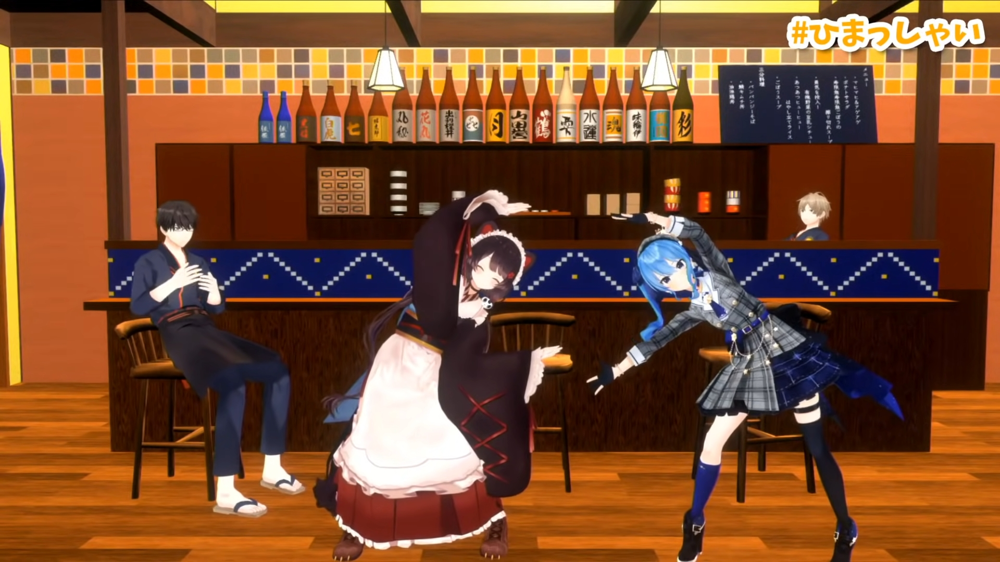

---
# NavLink
prev:
  text: 'Previous: Tokomachi in 2020'
  link: /timeline/2020/

next:
  text: 'Next: Tokomachi in 2022'
  link: /timeline/2022/
---

# Tokomachi in 2021 (WIP)

## Tokomachi Radio

\#04 was the starting episode of the year.

They also had [<i class="fa-brands fa-youtube" /> Houshou Marine](https://www.youtube.com/channel/UCCzUftO8KOVkV4wQG1vkUvg) and [<i class="fa-brands fa-youtube" /> Ange Katerina](https://www.youtube.com/channel/UCHVXbQzkl3rDfsXWo8xi2qw) as their guests in #05 and #06.

_For more information, please read [<i class="fa-solid fa-microphone-lines" /> Topics: Tokomachi Radio](/topics/tokomachi_radio_s01/#episode-04)._

## 3rd Tokomachi Cover MV

### 2021-02-14

_For more information, please read [<i class="fa-solid fa-microphone-lines" /> Topics: Music Main List](/topics/music/list/)._

## First 3D Collab

### 2021-03-15

> [<i class="fa-brands fa-youtube" /> Original YouTube Stream](https://www.youtube.com/watch?v=Amko2amkaWM)

This was the first Tokomachi collab in 3D, held in [<i class="fa-brands fa-youtube" /> HIMASHOKUDO Channel](https://www.youtube.com/channel/UCom8rCUQZP98SIXJzMwjrxw/).

Both of them were funny and joked on the 2 hosts from the beginning till the end.

Although it was a rather casual stream having Tokomachi trying out the dished made by the hosts and answering some questions, this was the first time having NIJISANJI, hololive 3D and another agency's 3D model collab together.

This was the first step they took and a preparation for the upcoming live.

## Voice change

## "SPACE for Virtual GHOST"

### 2021-04-13

> [<i class="fa-brands fa-youtube" /> Timestamp: Toko's part](https://youtu.be/Ajwv4ANSSg0&t=770s)

This was Hoshimachi Suisei's 3rd Anniversary YouTube Live.

Toko appeared as one of the special guests.

_For more information, please read [<i class="fa-solid fa-microphone-lines" /> Topics: SPACE for Virtual GHOST](/topics/music/suisei_ghost/)._

## Teach me please Tokomachi

### 2021-06-06

> [<i class="fa-brands fa-youtube" /> Original YouTube Stream](https://www.youtube.com/watch?v=QQB79VAyWAw)

This was a chatting stream talking about _Ensemble Stars_ series specifically for 4 whole hours.

The length of the stream was pretty uncommon for both of them by that time. They showed how they loved the franchise there. According to themselves, it was like what they do in their daily life talking with each other about EnSta.

## Virtual Music Award 2021

### 2021-07-04

### After Talk

#### About Tenkyuu

#### About GHOST

## 4th Tokomachi Cover MV

### 2021-06-30

## 1m Congratulations

### 2021-06-30

## "STELLAR into the GALAXY"

### 2021-10-21

_For more information, please read [<i class="fa-solid fa-microphone-lines" /> Topics: STELLAR into the GALAXY](/topics/music/suisei_galaxy/)._

## Tokomachi Radio 1st Anniversary

### 201-10-30

_For more information, please read [<i class="fa-solid fa-microphone-lines" /> Topics: Tokomachi Radio Episode 13](/topics/tokomachi_radio_s01/#episode-13-1st-anniversary)._

## Summary

2021 Tokomachi took another big step forward. They got their first public 3D collab and live appearance, Suisei also invited to her 1st solo live as a return and said inviting Toko meant she wanted to forge her future with Toko, also breaking the walls between agencies. So far they were considered _the icon_ of inter-agencies cooperations.

Although there were nearly totally nothing after Suisei's 1st solo live because their schedules were totally full and even had no time for Tokomachi Radio (got 2 episodes delayed), but we still can expect for further leaps in 2022.

Like Suisei said before, it was mutual respect, they all have their solo works to do and the best way was to support each other properly.

## Appendix: Casual Tweet
