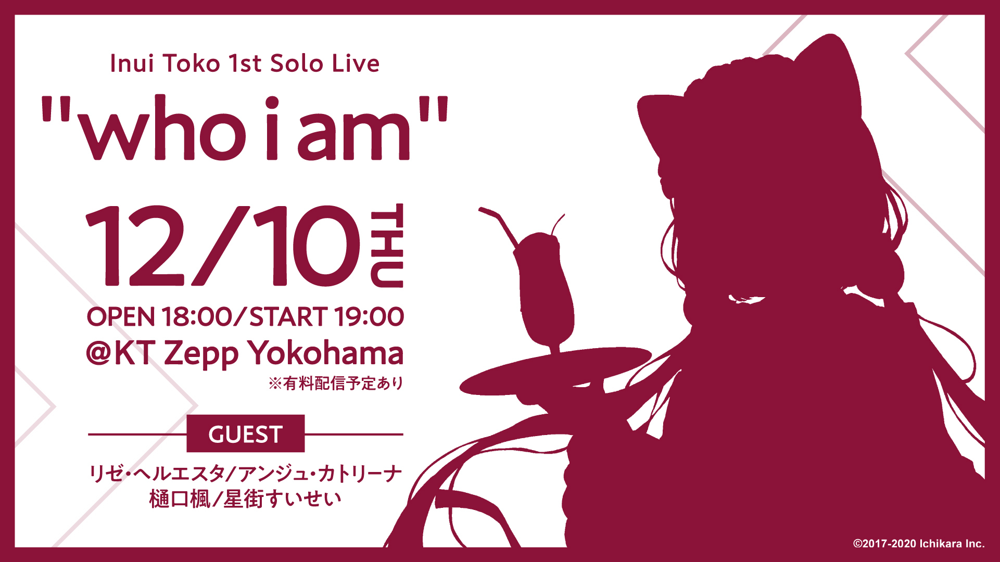
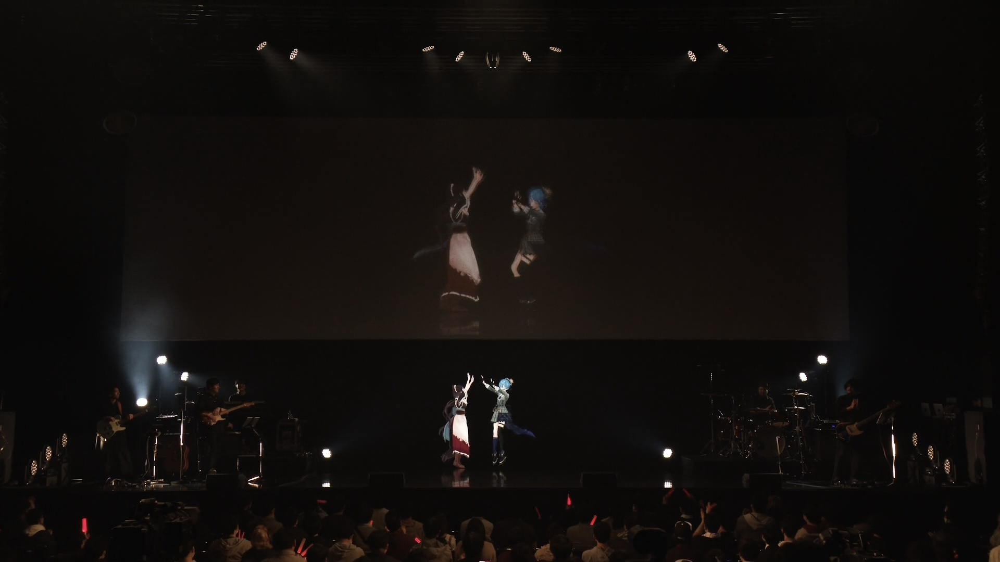
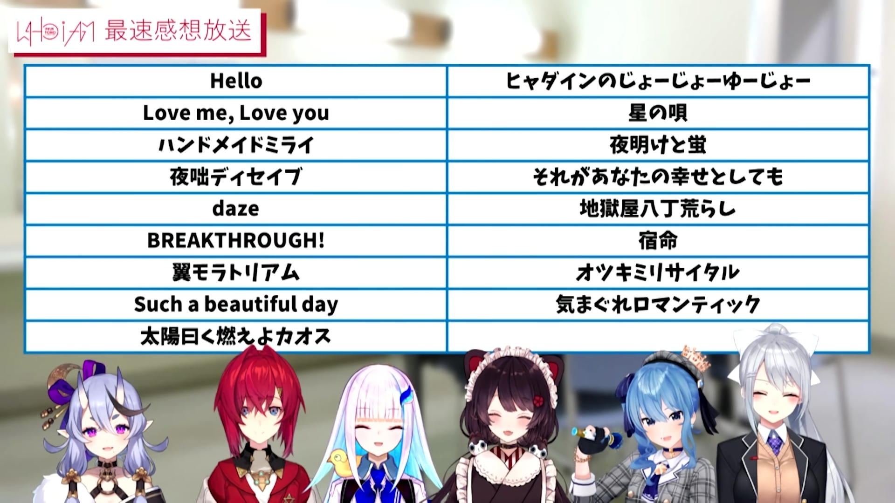

---
# NavLink
prev:
  text: "Previous: Tokomachi in 2020"
  link: /timeline/2020

next:
  text: "Next: \"Space for Virtual GHOST\""
  link: /timeline/2021
---

# "who i am"

::: warning Paid Event

This is a paid live, originally streamed on Niconico. If you are interested in their performances, you can purchase *Blu-ray Disc* from [<i class="fa-solid fa-compact-disc" /> Nijisanji Shop ](https://shop.nijisanji.jp/s/niji/item/detail/NJSJ-026).

:::

The live was held on Dec. 10, 2020 in KT Zepp Yokohama.

Suisei and Toko finally fulfilled [their dreams back in 2019](/timeline/2019/#_2019-06-08).

## Setlist

 

Suisei appeared on stage as the second guest, singed 2 songs with Toko.
- BREAKTHROUGH, Trickstar (Ensemble Stars!!)
- Tsubasa Moratorium, ALKALOID (Ensemble Stars!!)

## MC

Suisei was very excited seeing the live guests since she had been on virtual live stages.

MC1:
- Suisei is not affiliated to Nijisanji.
- They bought the same size of water (different from normal), fried chicken and meat steamed buns without discussion.
- There might be already soul-level connections between them.
- They started to exchange their ways of laughing, Toko started to laugh in Suisei did and Suisei did an "Aha↑" before in the street.
- Toko is feeling shy when saying "Toko-chan is cute today" because she's already over 200 years.
- Toko did gacha for Suisei and got the target character.

MC2:
- Toko is exhausted after singing and dancing with Suisei for 2 songs.
- Toko admitted that she's over 200 years old while Suisei is eternal 18 years and was totally alright.
- They thought it would be great to dance while singing, but they got no professional dancing tutor so they have to watch the MV over and over again to remember the dance step which cost them a long long time.

## After Talk

::: warning Paid Event

This was a partially paywalled stream on Nijisanji Niconico Fanclub.

:::

Toko talking about Suisei:
- Toko spent most time before live rehersaling with Suisei, even longer than Lize or Ange.
- Toko and Suisei chose the songs they actually singed before in Karaoke.

## Related posts

・ [<i class="fa-solid fa-calendar-days" /> *Timeline: Tokomachi in 2020* ](/timeline/2020/#inui-toko-1st-solo-live-who-i-am) &nbsp; <i class="fa-solid fa-arrow-right-from-bracket"></i>

・ [<i class="fa-solid fa-microphone-lines" /> *Topics: Tokomachi Music* ](/topics/music/) &nbsp; <i class="fa-solid fa-arrow-right-from-bracket"></i>

<!-- FontAwesome Script -->

<link rel="stylesheet" href="https://cdn.jsdelivr.net/npm/@fortawesome/fontawesome-free@6.0.0/css/all.min.css" crossorigin="anonymous">